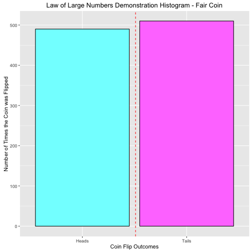
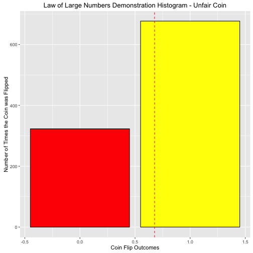

Law of Large Numbers
========================================================
author: Levi Brackman
date: March 29, 2016

Pitch of App
========================================================

My Shiny app has three main aims:

- To demonstrate the law of large numbers
- To allow the user to play with different inputs themselves
- To help the beginner student of statistics understand the Law of Large Numbers without the Math

The Code the Powers the App
========================================================


```r
flips <- sample(c(0,1), 1000, replace = TRUE, prob = c(0.5, 0.5))
    flips<-as.data.frame(flips)
    flips$flips[flips$flips==1] <- 2
    flips$flips[flips$flips==0] <- 1
    
unfairflips <- sample(c(0,1), 1000, replace = TRUE, prob = c(0.3, 0.7))
unfairflips<-as.data.frame(unfairflips)
unfairflips$flips[unfairflips$unfairflips==1] <- 2
unfairflips$flips[unfairflips$unfairflips==0] <- 1
```

Plot of the 1000 flips with a Fair Coin
========================================================


Plot of the 1000 flips with a Unfair Coin
========================================================


Conclusion
========================================================
This presentation has been about the Law of Large Numbers Shiny app and included the following:

The code that powers the app

1.  A random generator with 50/50 chance
2.  A random generator with 30/70 chance

The app itself allows the following
- To allow the user to play with different inputs themselves
- Understand the Law of Large Numbers intuitively without the Math
